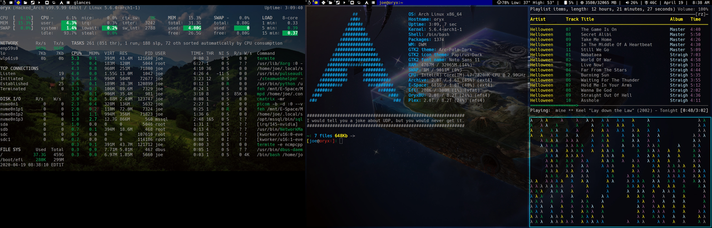

## My Custom DWM 6.2 Build

 

#### Overview:

This project is my latest build of DWM 6.2  which I run under Arch / Arco Linux  [ *😊️Hacked to my liking* ]   . 

This project  includes my compiled version of DWM as well as some refference information under the Notes folder which includes:

- Keybinding Overview
- Some Icons used in my config.h
- My autostart (Applications launched for this session )

#### Further Resources on my set up can be found:
[My Arch Config Repository](https://github.com/ByteAbyss/ArchConfig) 
-  Dot Files ( .vimrc , .bashrc , .xprofile ...)
-  Package List
-  pacman.conf

 
#### Resources:
- [Suckless.org](https://dwm.suckless.org) 
- [Arch Linux Wiki](https://wiki.archlinux.org) 
- [Arco Linux ](https://arcolinux.com) 

#### Clone , Compile , Go ...

This has been built & tested with the current packages on my system. ( ..Use at your own risk .. ) You can download and or clone and run a clean install : 

	sudo make clean install
	
and use the default bindings or you can modify my config.h prior to make it work better for you. 


If  you would rather walk through all the steps to best understand & customize for yourself  you can follow the flow below    and leverage the Suckless Teams resources to build.

#### Install From Source 

Download & extract tar ball of base build source code. 

```
tar -xvf  dwm-6.2.tar.gz
```

Edit config.mk to match your local setup (dwm is installed into
the /usr/local namespace by default).

Afterwards enter the following command to build and install dwm (if  necessary as root):

    make clean install
    
   
####  Pattches Used in my build:

-  Auto Start: dwm-autostart-20161205-bb3bd6f.diff
-  Fake Full Screen: dwm-fakefullscreen-20170508-ceac8c9.diff
-  Rotate Stack: dwm-rotatestack-20161021-ab9571b.diff
-  Vanity Gaps: dwm-vanitygaps-20190508-6.2.diff
-  Focusonnetactive: dwm-focusonnetactive-2017-12-24-3756f7f.diff
-  Systray: dwm-systray-6.2.diff
-  C-Facts: 
	- 	dwm-cfacts-6.2.diff
	- 	dwm-cfacts_centeredmaster-6.2.diff
	- 	dwm-cfacts_deck-6.2.diff
 

-- 

-    [More Patches Here](https://dwm.suckless.org/patches/) 

--   

**   Apply: **

	   patch -p1 < path/to/patch.diff
   
   